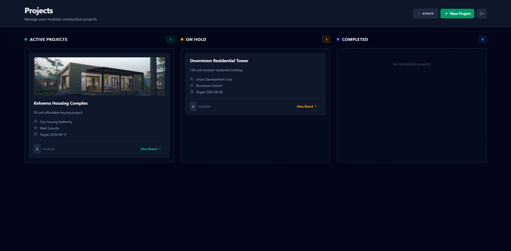
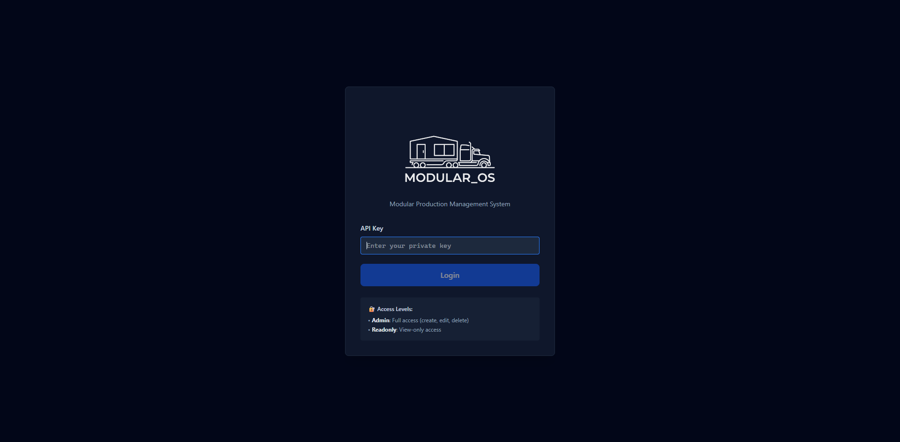
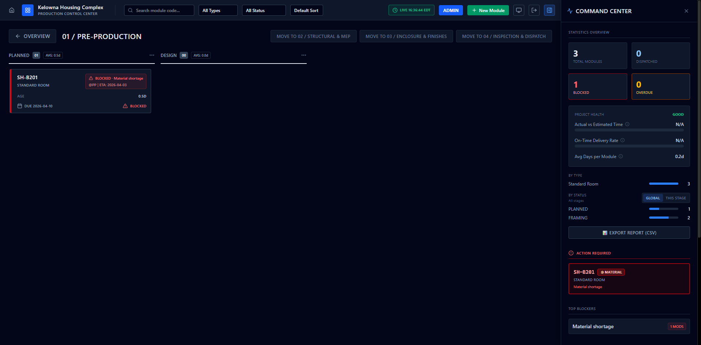
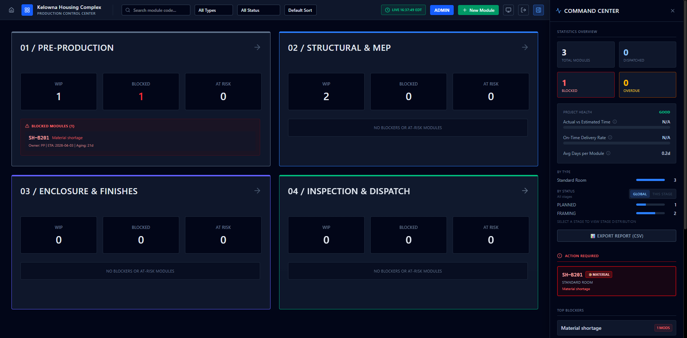

  
  
  
  

  <a href="https://github.com/YSKM523/modular_os-showcase/issues/new">Request walkthrough</a> |
  <a href="https://github.com/YSKM523/modular_os-showcase/issues">Open an issue</a> |
  <a href="./CHANGELOG.md">View changelog</a> |
  <a href="https://github.com/YSKM523">GitHub profile</a>

# Modular_OS Showcase

Public-facing home for the `Modular_OS` project.

`Modular_OS` is a modular-construction production control console focused on factory-floor execution, WIP visibility, blocker handling, dispatch tracking, and realtime operations.

## Snapshot

- Product status: active development
- Code visibility: private source, public showcase
- Primary use case: modular construction production control
- Delivery model: web app with desktop packaging support
- Public signal: updates, previews, roadmap, and contact surface live here

## Product Story

Most production tools in modular construction are fragmented across spreadsheets, status chats, whiteboards, and generic project trackers. That creates a predictable problem: operations leaders can see activity, but they cannot see flow.

`Modular_OS` is being built to solve that gap. The goal is not to create another generic Kanban board. The goal is to give modular construction teams a B2B operating layer that makes stage movement, blockers, dispatch readiness, and execution risk visible in one place.

From a product perspective, this is aimed at real operating teams:

- plant managers who need a reliable system of record for production flow
- operations leads who need live visibility into WIP pressure and blockers
- project stakeholders who need cleaner status reporting without manual follow-up
- teams that want software shaped around modular construction, not adapted from generic task tools

The long-term direction is clear: `Modular_OS` should feel less like a board and more like a production operating system for modular construction businesses.

## Contact Buttons

## Interface Preview

### Operations Overview

High-level command center for plant managers and operations leads. This view is designed to surface flow health, blockers, and dispatch readiness in one scan.

### Project Pipeline

Project-level planning surface for sequencing work, tracking readiness, and keeping delivery flow visible before execution pressure builds downstream.

### Module Control Board

Module-level execution board for moving work through production stages with clearer status control, ownership, and bottleneck visibility on the floor.

### Activity and Coordination

Realtime activity layer for tracking changes, coordination signals, and follow-up actions. It is meant to help supervisors understand what changed and where attention is needed next.

### Screenshot Notes

These screens are not framed as a generic project dashboard. They are intended to communicate B2B production control:

- the overview layer is designed to surface flow health, blocker pressure, and stage readiness quickly
- the project and module views are built around production movement, not generic task sorting
- the activity and coordination surfaces are meant to help supervisors and operators scan risk fast
- the product is being shaped so a factory team can understand what is blocked, what is overloaded, and what is ready to move in seconds

The design target is practical software for operations teams: structured, legible, fast to scan, and built around real production handoffs.

## What It Does

- Tracks projects and modules through a multi-stage production flow
- Surfaces WIP pressure, blockers, overdue work, and dispatch readiness
- Supports realtime collaboration and event logging
- Provides API-key based access control for operations teams
- Includes desktop packaging support through Electron

## Stack

- React
- TypeScript
- Vite
- Express
- Prisma
- SQLite
- Socket.IO
- Electron

## Why This Repo Is Public

The implementation repository is currently private while the product is still evolving. This public repo exists so people can see what I am building, follow progress, and understand the direction of `Modular_OS`.

## Current Roadmap

- Improve production analytics and KPI reporting
- Harden deployment and runtime data management
- Expand project, module, and blocker workflows
- Refine desktop packaging and release flow
- Prepare a cleaner public-facing product presentation

## Next Version Plan

The next visible version of `Modular_OS` is being shaped around a stronger B2B software standard.

### Product

- tighten the language and layout so the product reads like operations software, not a prototype
- improve role clarity for managers, supervisors, and read-only stakeholders
- expand production metrics so teams can understand throughput, delay sources, and execution health faster

### Workflow

- deepen blocker management with better ownership, resolution tracking, and audit clarity
- strengthen dispatch readiness and stage transition logic
- improve how projects, modules, and logs connect across the production lifecycle

### Platform

- harden runtime data handling and deployment flow
- improve desktop packaging and release reliability
- continue standardizing naming, structure, and operational setup around `Modular_OS`

### Public-facing

- publish more annotated screenshots and feature walkthroughs
- sharpen product positioning around modular construction production control software
- keep improving public content so the project is easier to understand for operators, buyers, and collaborators

## Changelog

- Latest public-facing updates: [CHANGELOG.md](./CHANGELOG.md)
- Current milestone: project naming, showcase visibility, and public profile placement are now in place

## Progress Notes

- The core product is now renamed and consolidated under `Modular_OS`
- The runtime path and service naming have been standardized around `modular_os`
- A private source repository is live and tracked separately from this showcase repo
- This public repo will continue to receive product-facing updates, previews, and progress signals

## SEO Direction

The public content around `Modular_OS` is being tuned for discoverability around searches such as:

- modular construction software
- modular construction production software
- prefab manufacturing software
- offsite construction operations software
- production control software for modular construction
- factory workflow software for modular building teams

The content strategy is to stay specific and product-led rather than generic. That means clearer B2B positioning, stronger problem framing, and more concrete screenshots and updates over time.

## Repositories

- Public showcase: [YSKM523/modular_os-showcase](https://github.com/YSKM523/modular_os-showcase)
- Private source repository: `YSKM523/modular_os`

## Contact

- GitHub profile: [@YSKM523](https://github.com/YSKM523)
- Project showcase: [YSKM523/modular_os-showcase](https://github.com/YSKM523/modular_os-showcase)
- Walkthrough / product interest: [open an issue](https://github.com/YSKM523/modular_os-showcase/issues/new)
- Progress log: [CHANGELOG.md](./CHANGELOG.md)
