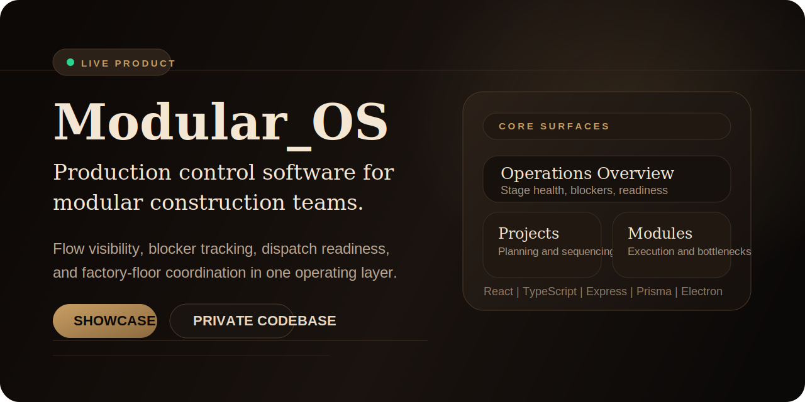
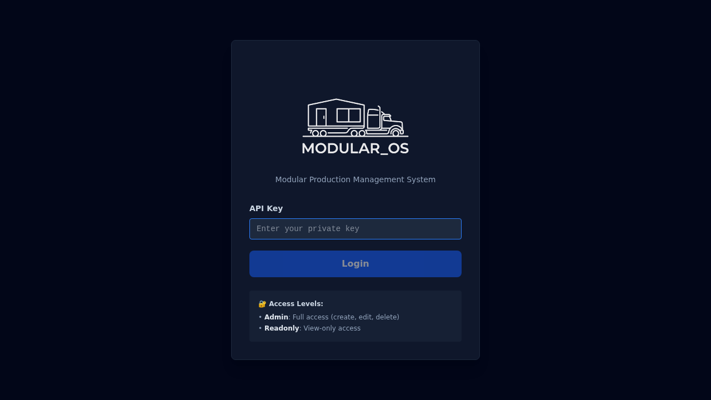

  

  
  
  
  

  <a href="https://github.com/YSKM523/modular_os-showcase/issues/new">Request walkthrough</a> ·
  <a href="https://github.com/YSKM523/modular_os-showcase/issues">Open an issue</a> ·
  <a href="./CHANGELOG.md">View changelog</a> ·
  <a href="https://github.com/YSKM523">GitHub profile</a>

# Modular_OS Showcase

Public-facing home for the `Modular_OS` project.

`Modular_OS` is a modular-construction production control console focused on factory-floor execution, WIP visibility, blocker handling, dispatch tracking, and realtime operations.

## Snapshot

- Product status: active development
- Code visibility: private source, public showcase
- Primary use case: modular construction production control
- Delivery model: web app with desktop packaging support
- Public signal: updates, previews, roadmap, and contact surface live here

## Contact Buttons

## Interface Preview

## What It Does

- Tracks projects and modules through a multi-stage production flow
- Surfaces WIP pressure, blockers, overdue work, and dispatch readiness
- Supports realtime collaboration and event logging
- Provides API-key based access control for operations teams
- Includes desktop packaging support through Electron

## Stack

- React
- TypeScript
- Vite
- Express
- Prisma
- SQLite
- Socket.IO
- Electron

## Why This Repo Is Public

The implementation repository is currently private while the product is still evolving. This public repo exists so people can see what I am building, follow progress, and understand the direction of `Modular_OS`.

## Current Roadmap

- Improve production analytics and KPI reporting
- Harden deployment and runtime data management
- Expand project, module, and blocker workflows
- Refine desktop packaging and release flow
- Prepare a cleaner public-facing product presentation

## Changelog

- Latest public-facing updates: [CHANGELOG.md](./CHANGELOG.md)
- Current milestone: project naming, showcase visibility, and public profile placement are now in place

## Progress Notes

- The core product is now renamed and consolidated under `Modular_OS`
- The runtime path and service naming have been standardized around `modular_os`
- A private source repository is live and tracked separately from this showcase repo
- This public repo will continue to receive product-facing updates, previews, and progress signals

## Repositories

- Public showcase: [YSKM523/modular_os-showcase](https://github.com/YSKM523/modular_os-showcase)
- Private source repository: `YSKM523/modular_os`

## Contact

- GitHub profile: [@YSKM523](https://github.com/YSKM523)
- Project showcase: [YSKM523/modular_os-showcase](https://github.com/YSKM523/modular_os-showcase)
- Walkthrough / product interest: [open an issue](https://github.com/YSKM523/modular_os-showcase/issues/new)
- Progress log: [CHANGELOG.md](./CHANGELOG.md)
